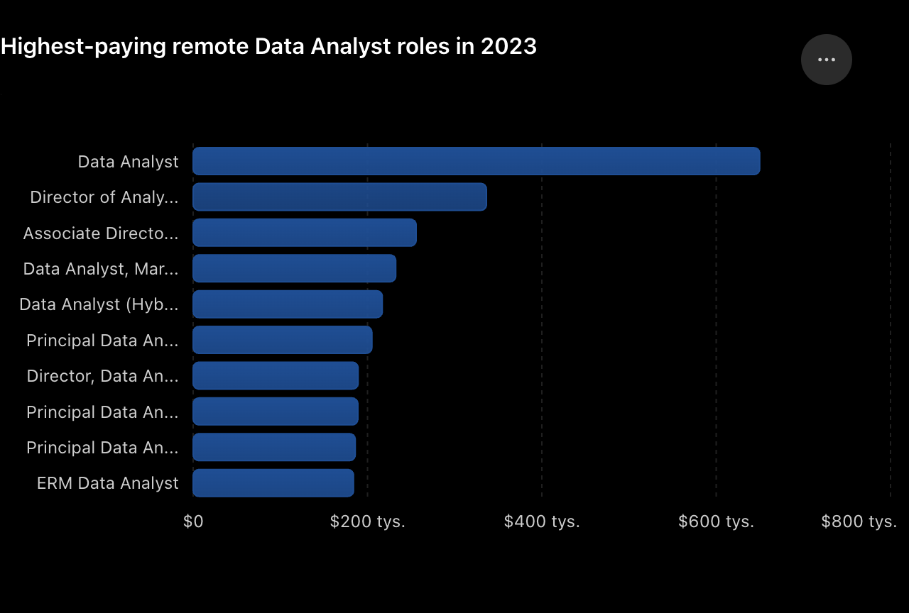
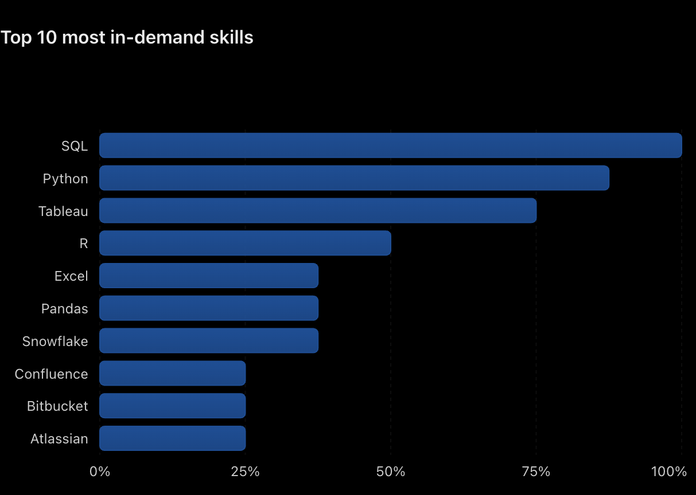

# Introduction
📊 Dive into the data job market! Focusing on data analyst roles, this project explores top-paying jobs, in-demand skills and where high demand meets high salary in data analytics.

💡**SQL queries?** Check them out here: [project_sql folder](/project.sql/)


# Background
This project explores the **Data Analyst job market** 💼 by analyzing job postings across different locations. The analysis focuses on the most in-demand skills, Data Analyst roles, and associated salaries. 

💥 The goal is to **identify patterns** in employer requirements and understand how skills and compensation vary across different locations.

### The questions I wanted answer through my SQL queries were:
1. What are the top-paying Data Analyst job?
2. What skills are required for these top-paying jobs?
3. What skills are most in-demand for Data Analysts?
4. Which skills are associated with higher salaries?
5. What are the most optimal skills to learn?

# Tools I used
For my deep dive into the Data Analyst job market, I harnessed the power of several tools:

- **SQL:** the backbone of my analysis, allowing me to query the database and unearth critical insights.
- **PostgreSQL:** the chosen database management system, ideal for handling the job posting data.
- **VS Code**: my go-to for database management and executing SQL queries.
- **Git & GitHub:** essential for version control and sharing my SQL scripts and analysis, ensuring collaboration and project tracking.  

# The Analysis
Each query for this project aimed at investigating 🔍 specific aspects of the Data Analyst job market. Here's how I approached each question:

### 1. Top paying Data Analyst jobs 💰
To identify the highest-paying roles, I filtered Data Analyst positions by average yearly salary and location, focusing on remote jobs. This query highlights the high paying opportunities in the field. 

```sql
SELECT
    job_id,
    job_title,
    job_location,
    job_schedule_type,
    salary_year_avg,
    job_posted_date,
    name AS company_name
FROM 
    job_postings_fact
LEFT JOIN company_dim ON job_postings_fact.company_id = company_dim.company_id
WHERE job_title_short = 'Data Analyst' AND
    job_location = 'Anywhere' AND
    salary_year_avg IS NOT NULL
ORDER BY 
    salary_year_avg DESC
LIMIT 10
```
📌 Here's the breakdown of the top Data Analyst jobs in 2023:
- **Wide Salary Range:** Top 10 paying Data Analyst roles span from $184 000 to $650 000, indicating significant salary potential in the field. 
- **Diverse Employers:** Companies like SmartAsset, META and AT&T are among those offering high salaries, showing a broad interest across different industries. 
- **Job Title Variety:** There's a high diversity in job titles, from Data Analyst to Director of Analytics, reflecting varied roles and specializations within data analytics. 


*Bar graph visualizing the salary for top 10 Data Analyst jobs: ChatGPT generated this graph from my SQL query results*

### 2. Skills for top-paying Data Analyst jobs 💻
To identify skills associated with top-paying jobs, I analyzed the highest-paying job postings from the previous query and extracted the skills listed within them. This illustrates which tools are most valuable to learn for anyone seeking a lucrative Data Analyst position.

```sql
WITH top_paying_jobs AS (
SELECT
    job_id,
    job_title,
    salary_year_avg,
    name AS company_name
FROM 
    job_postings_fact
LEFT JOIN company_dim ON job_postings_fact.company_id = company_dim.company_id
WHERE job_title_short = 'Data Analyst' AND
    job_location = 'Anywhere' AND
    salary_year_avg IS NOT NULL
ORDER BY 
    salary_year_avg DESC
LIMIT 10
)

SELECT 
    top_paying_jobs.*,
    skills
FROM top_paying_jobs
INNER JOIN skills_job_dim ON top_paying_jobs.job_id = skills_job_dim.job_id
INNER JOIN skills_dim ON skills_job_dim.skill_id = skills_dim.skill_id
ORDER BY 
    salary_year_avg DESC
```

📌 Here's key insgihts about the most required skills for top-paying Data Analyst jobs:
- **SQL** and **Python** are the most in-demand skills, appearing in 100% and 87.5% of the analyzed job postings. 
- **Tableau** is also highly requested, appearing in 75% of postings, while **R**, **Excel**, and **Pandas** appear less frequently. 
- Overall, the results show that employers value a **combination of strong data analysis, programming, and data visualization skills**.


*Bar graph visualizing skills for top-paying Data Analyst jobs: ChatGPT generated this graph from my SQL query results*

### 3. Top in-demand skills for Data Analyst jobs in Poland 📍
To identify the most in-demand skills for Data Analyst roles in Poland, I calculated the frequency of each skill mentioned in the job postings.

```sql
SELECT 
    skills,
    job_location,
    COUNT(skills_job_dim.job_id) AS demand_count
FROM job_postings_fact
INNER JOIN skills_job_dim ON job_postings_fact.job_id = skills_job_dim.job_id
INNER JOIN skills_dim ON skills_job_dim.skill_id = skills_dim.skill_id
WHERE
    job_title_short = 'Data Analyst' AND     
    job_location LIKE '%Poland%'
GROUP BY   
    skills, job_location
ORDER BY demand_count DESC
LIMIT 5
```

📌 Here's key insgihts about the top in-demand skills for Data Analyst jobs in Poland:
- **SQL** is the most in-demand skill, appearing in 569 Warsaw job postings and 238 Kraków postings (807 in total).
- **Excel** remains highly relevant, ranking second in Warsaw with 450 postings.
- **Python** has strong demand with 373 postings, highlighting the importance of programming alongside traditional analytics tools.
- **Tableau** is also frequently requested, showing that data visualization is an important part of the Data Analyst skill set.
- Warsaw shows substantially more skill-related job postings than Kraków in this dataset.

| Skill   | Demand Count |
|---------|--------------|
| SQL     | 807          |
| Excel   | 450          |
| Python  | 373          |
| Tableau | 288          |

*Table of the demand for the top skills in Data Analyst jobs in Poland.*

### 4. Top paying skills for Data Analyst jobs 💵
To identify the highest-paying skills for Data Analyst roles across all locations, I calculated the average salary associated with each skill mentioned in the job postings.

```sql
SELECT 
    skills,
    ROUND(AVG(salary_year_avg), 0) AS avg_salary
FROM job_postings_fact
INNER JOIN skills_job_dim ON job_postings_fact.job_id = skills_job_dim.job_id
INNER JOIN skills_dim ON skills_job_dim.skill_id = skills_dim.skill_id
WHERE
    job_title_short = 'Data Analyst' AND
    salary_year_avg IS NOT NULL
GROUP BY   
    skills
ORDER BY 
    avg_salary DESC
LIMIT 25
```

📌 Here's key insgihts about 25 top-paying skills for Data Analyst jobs:
- **Specialized technical skills dominate:** The list is heavily focused on tools and technologies related to **cloud**, **DevOps**, **machine learning**, and **data engineering**, rather than traditional data-analysis tools.
- **Machine learning is strongly represented:** Skills such as **Datarobot**, **MXNet**, **Keras**, **PyTorch**, **TensorFlow**, and **Hugging Face** all appear, suggesting that **ML/AI** capabilities are associated with higher-paying analyst roles.
- **Cloud & DevOps skills are valuable:** **Terraform**, **VMware**, **Ansible**, **Puppet**, **GitLab**, **Kafka**, and **Airflow** indicate demand for analysts who can work within modern data infrastructure.
- **Programming skills matter:** **Golang**, **Scala**, **Perl**, and **Dplyr** appear among the highest-paying skills, showing that coding ability can significantly increase earning potential.
- **The top salary is an outlier:** **SVN** shows an average salary of $400K, substantially above the rest of the list. The second-highest, Solidity, is $179K, so SVN likely warrants further investigation as a potential data anomaly or unusually specialized role.
- **Overall trend:** The highest-paying skills seem to move beyond basic reporting and visualization toward **AI/ML + data engineering + cloud infrastructure**.

| Skill        | Average Salary($) |
|--------------|--------------------|
| SVN          | $400,000 |
| Solidity     | $179,000 |
| Couchbase    | $160,515 |
| DataRobot    | $155,486 |
| Golang       | $155,000 |
| MXNet        | $149,000 |
| dplyr        | $147,633 |
| VMware       | $147,500 |
| Terraform    | $146,734 |
| Twilio       | $138,500 |
| GitLab       | $134,126 |
| Kafka        | $129,999 |
| Puppet       | $129,820 |
| Keras        | $127,013 |
| PyTorch      | $125,226 |
| Perl         | $124,686 |
| Ansible      | $124,370 |
| Hugging Face | $123,950 |
| TensorFlow   | $120,647 |
| Cassandra    | $118,407 |
| Notion       | $118,092 |
| Atlassian    | $117,966 |
| Bitbucket    | $116,712 |
| Airflow      | $116,387 |
| Scala        | $115,480 |

*Table of the skills demanded in top-paying Data Analyst jobs.*

### 5. Top 20 Skills to learn for Data Analyst jobs 
To determine the optimal skill set for remote Data Analysts jobs, I crossed-referenced the most frequently demanded skills with those associated with the highest average salaries.

```sql
SELECT
    skills_dim.skill_id,
    skills_dim.skills,
    COUNT(skills_job_dim.job_id) AS demand_count,
    ROUND(AVG(job_postings_fact.salary_year_avg), 0) AS avg_salary
FROM job_postings_fact
INNER JOIN skills_job_dim ON job_postings_fact.job_id = skills_job_dim.job_id
INNER JOIN skills_dim ON skills_job_dim.skill_id = skills_dim.skill_id
WHERE
    job_title_short = 'Data Analyst'
    AND salary_year_avg IS NOT NULL
    AND job_work_from_home = TRUE
GROUP BY 
    skills_dim.skill_id
HAVING 
    COUNT(skills_job_dim.job_id) > 10
ORDER BY 
    avg_salary DESC,
    demand_count DESC
LIMIT 20
```

📌 Here's key insgihts about 20 most optimal skills for Data Analyst jobs based on average salaries of those jobs:
- **Python** and **Tableau** stand out clearly in demand, appearing in 236 and 230 job postings respectively. Both also maintain average salaries close to or above $100K, making them strong general-purpose skills.
- **R** is another highly demanded analytical skill, with 148 postings and an average salary of about $100.5K.
- **Cloud** and **data engineering** technologies offer higher salary potential. **Snowflake**, **Azure**, **AWS**, and **Hadoop** all show average salaries above $108K, although demand is much lower than for Python or Tableau.
- **Go** has the highest average salary at $115,320, but appears in only 27 postings, suggesting it is a more specialized skill rather than a core Data Analyst requirement.
- Overall, the data suggests that high demand does not automatically mean the highest salary. **Skills such as Python, Tableau, and R provide broader employment opportunities, while more specialized technologies can command higher salaries.**

| Skill      | Demand Count | Average Salary |
|------------|--------------|----------------|
| Go         | 27           | $115,320       |
| Confluence | 11           | $114,210       |
| Hadoop     | 22           | $113,193       |
| Snowflake  | 37           | $112,948       |
| Azure      | 34           | $111,225       |
| BigQuery   | 13           | $109,654       |
| AWS        | 32           | $108,317       |
| Java       | 17           | $106,906       |
| SSIS       | 12           | $106,683       |
| Jira       | 20           | $104,918       |
| Oracle     | 37           | $104,534       |
| Looker     | 49           | $103,795       |
| NoSQL      | 13           | $101,414       |
| Python     | 236          | $101,397       |
| R          | 148          | $100,499       |
| Redshift   | 16           | $99,936        |
| Qlik       | 13           | $99,631        |
| Tableau    | 230          | $99,288        |
| SSRS       | 14           | $99,171        |
| Spark      | 13           | $99,077        |

*Table of most optimal skills to learn for Data Analyst jobs.*

# What I learned
📒 Throughout this adventure, I've turbocharged my SQL toolkit with some serious firepower:

- **Complex Query Crafting:** Mastered the art of advanced SQL, merging tables and wielding WITH clauses for ninja-level temporary tables maneuvers.
- **Data Agregation:** Got cozy with GROUP BY and turned aggregate functions like COUNT() and AVG() into my data-summarizing sidekicks.
- **Analytical Wizardry:** Leveled up my real-world puzzle-solving skills, turning questions into actionable, insightful SQL queries. 

# Conclusions

### Insights 🔎
- **SQL** and **Python** are core Data Analyst skills, with consistently high demand across job postings.
- **Tableau** and **R** remain important, especially for visualization and statistical analysis.
- High demand does not always mean the highest salary - specialized skills often offer stronger salary potential.
- **Cloud**, **data engineering**, and **AI/ML** skills such as **AWS**, **Azure**, **Snowflake**, **TensorFlow**, and **PyTorch** are linked to higher-paying roles.
- Overall, **the strongest career opportunities come from combining data analysis, programming, visualization, and modern data technologies.**

### Closing Thoughts 💡
This project was a great opportunity to improve my SQL skills while exploring the Data Analyst job market in more depth. The analysis helped identify which skills are both frequently requested by employers and associated with higher salaries, making it easier to understand where to focus future learning efforts. It also showed how important it is to keep developing new skills and stay aware of changing trends in the data analytics field.
